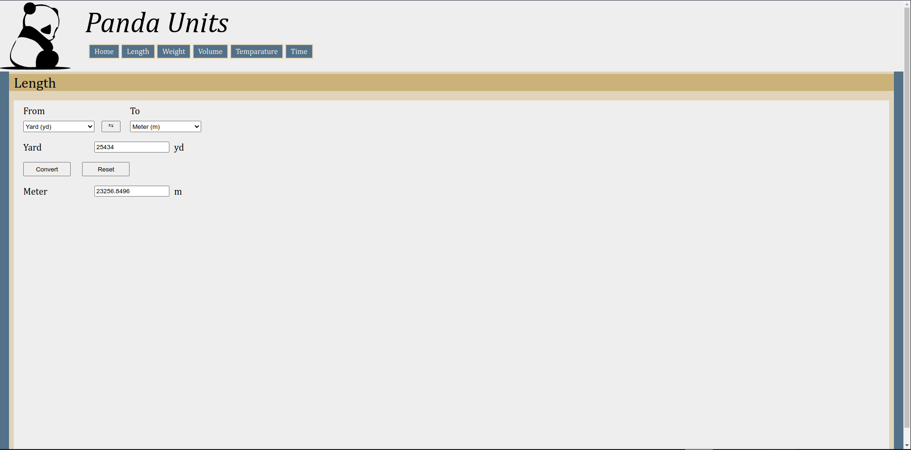

# PandaUnits
A versatile website designed to streamline the process of converting various units of measurement. Whether you need to convert length, weight, volume, temperature or time.

## How it work
1. The user on the home page chooses which type of conversion they want by clicking the button/href to the correct HTML page (volume, length, etc.).

2. When the page loads, the script grabs the name of the page and loads another script with the same name as the HTML page. This is because each of these other scripts has a function called "convert()" that can be seen as an abstract function, with the same argument but different logic.

3. Perform validation of the unit type or input value and convert it.

